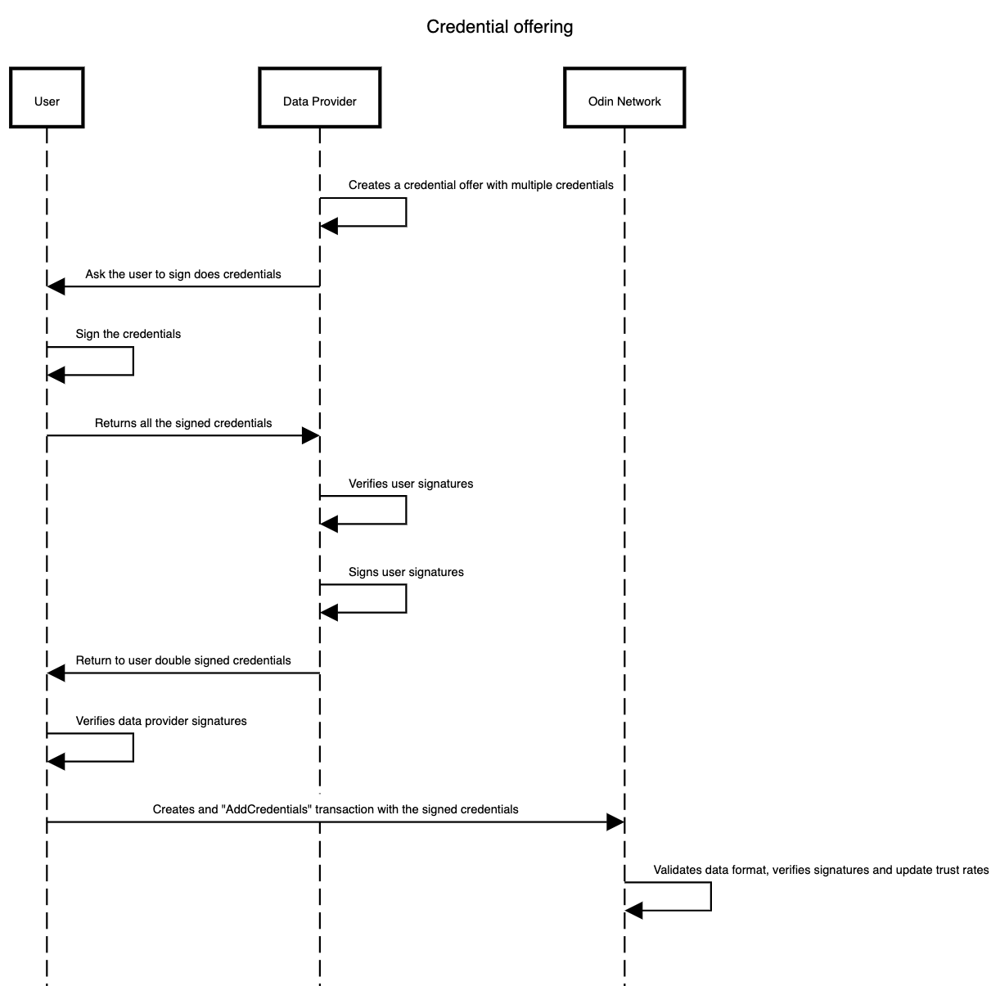

# Credentials

TrustMesh credentials are specific verifiable data fields which are used to compose user profiles. This credentials are issued by data providers to specific users.

## Credential offering data flow
1. A data provider creates a credential offering for a user which contains multiple credentials. 
2. The user accepts the credential offering, signs each credential and returns them back to the data provider.
3. The data provider verifies those signatures, sign user's signatures and return them back to the user.
4. User verifies data provider's signatures, and creates and `AddCredentials` transaction in Odin network.
5. Odin network validates data, signatures and updates trust rates.

**IMPORTANT**: Users are also able to reject some or all of the credentials offered by a data provider. In that case flows stops in after step 1, with the user rejecting does credentials.